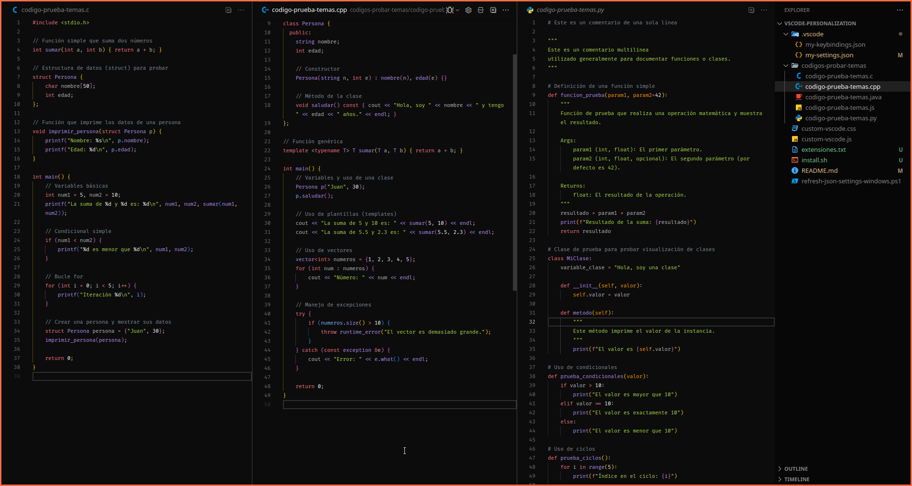
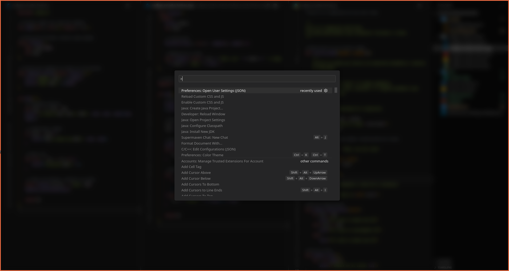

# My vscode personalization

https://github.com/user-attachments/assets/f7af48ab-a962-4b07-9d05-35980df9003b


>❗️**Important:** Install vscode from .deb file. Don't install from snap.

## Requierements

- **Theme:** amasterjt.amaster-theme
- **Custon Css and JS:** be5invis.vscode-custom-css
- **ICons:** pkief.material-icon-theme

⚠️ In Linux to use extention `be5intact.vscode-custom-css` you need to enable it as root user. Run: 
```bash
sudo code --user-data-dir="~/.vscode-root" --no-sandbox
```
 then restart vscode.

## Intallation
1. Clone this repo
2. go to Vscode-personalization folder
3. set executable permissions to `install.sh`
```bash
$ chmod +x install.sh
```
4. run `./install.sh`






# inspiration
[vscode-settings-json](https://github.com/glennraya/vscode-settings-json)